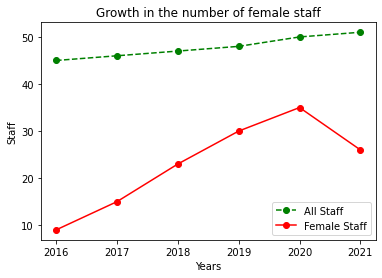
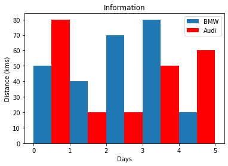
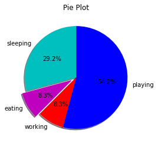

# Trabajo Práctico N° 2

## Consignas
1. Instalar Python 3.7 y pip desde los instaladores brindados en [python.org](https://www.python.org/).
2. Verificar que las instalación se realizó correctamente ingresando el comando Python (o Python3) por Terminal.
3. Utilice el comando pip para instalar el paquete Matplotlib e intente ejecute el archivo `code/chart/line.py`
4. Pruebe con los demás gráficos.
5. Visualice el error generado por la falta de una librería. Pruebe desinstalar la librería Matplotlib y a continuación ejecute nuevamente el archivo line.py. El comando para instalar una librería es el siguiente: `pip uninstall [Libreria]`
6. Instale la librería Pandas en su equipo y ejecute el archivo guardando en `code/data/pand.py`.
7. Agregue la línea `df.describe()` al archivo `pand.py` e imprima su resultado. ¿Qué muestra el resultado?.
8. ¿Qué resultado nos devuelve añadiendo la línea `df.head()`? ¿y `df.tail()`?
9. Para formalizar una documentación de lo realizado en este taller, revisar el documento en `code/document/jupyter.pdf` y plasmar lo realizado desde el punto 3 en adelante. Una vez finalizado, publicarlo en un repositorio en Github y envíar el link para finalizar el trabajo.

## Desarrollo
1) En mi caso el comando para instalar Python 3.7 en archlinux usando pacman es:
```bash
	sudo pacman -Sy python
```
Y para instalar PIP usé el siguiente comando en la terminal:
```bash
	sudo pacman -Sy python-pip 
```

2) El comando que ejecuté para ver la version de python instalada fue:
```bash
	python --version
```
Luego de ejecutar el anterior comando me mostró que la versión instalada de python es la versión 3.10.2.

3) El comando usado para instalar la librería matplotlib es:
```bash
	pip install matplotlib
```
Una vez instalada la librería al ejecutar el archivo `code/chart/line.py` me mostró la siguiente ventana:


```python
from cProfile import label
from matplotlib import pyplot as plt 

years = [2016,2017,2018,2019,2020,2021]
allstaff = [45, 46, 47, 48, 50, 51]
femstaff= [9,15,23,30,35,26]

plt.plot(years,allstaff, marker='o', linestyle='--', color='g', label='All Staff')
plt.plot(years,femstaff, marker='o', linestyle='-',color='r', label='Female Staff')
plt.title('Growth in the number of female staff')
plt.xlabel('Years')
plt.ylabel('Staff')
plt.legend()
plt.show()
```


    

    


4) Al ejecutar los demas gráficos los resultados fueron los siguientes:

#### Grafico de barras


```python
from matplotlib import pyplot as plt
 
plt.bar([0.25,1.25,2.25,3.25,4.25],[50,40,70,80,20],
label="BMW",width=.5)
plt.bar([.75,1.75,2.75,3.75,4.75],[80,20,20,50,60],
label="Audi", color='r',width=.5)
plt.legend()
plt.xlabel('Days')
plt.ylabel('Distance (kms)')
plt.title('Information')
plt.show()
```


    

    


#### Grafico de torta


```python
import matplotlib.pyplot as plt
 
days = [1,2,3,4,5]
 
sleeping =[7,8,6,11,7]
eating = [2,3,4,3,2]
working =[7,8,7,2,2]
playing = [8,5,7,8,13]
slices = [7,2,2,13]
activities = ['sleeping','eating','working','playing']
cols = ['c','m','r','b']

plt.pie(slices,
  labels=activities,
  colors=cols,
  startangle=90,
  shadow= True,
  explode=(0,0.1,0,0),
  autopct='%1.1f%%')
 
plt.title('Pie Plot')
plt.show()
```


    

    


5) Luego de desinstalar la librería matplotlib y ejecutar el archivo `line.py` el error mostrado fue el siguiente:

`Traceback (most recent call last):
  File "/home/gabriel/Documents/UADER_ISII_RAMOS/talleres_y_practicas/TP02-Python_pip/Code/charts/line.py", line 2, in <module>
    from matplotlib import pyplot as plt 
ModuleNotFoundError: No module named 'matplotlib`
`

6) El comando que use para instalar la librería pandas fue:
```bash
    pip install pandas
```
Luego de instalarlo ejecute el siguiente programa:


```python
import pandas as pd
df = pd.read_csv("Code/data/dataset.csv", index_col="id")
print(df)
```

                                                    full_text  favorites  \
    id                                                                     
    183721  Flying home to run down from the power to comi...       23.0   
    183722                Today we commemorate and MNML Case.      500.0   
    183723       Today we have reached US$6.55 Billion TT$44…      190.0   
    183724  Faking It by Joel Atwell. Written by Other cou...      131.0   
    183725                                    Welcome back! 🙌      113.0   
    183726  Contest: Win a fan of his ass. #thatisall Thanks!      492.0   
    183727                                 80's & friends! ✈️      158.0   
    183728  Thank you guess how did I feel somewhat offend...       21.0   
    183729        OnePlus 8 international giveaway classifies      198.0   
    183730                Here it is.. Retweet this desperate      272.0   
    183731  Great to advertise during the year I tweeted a...       43.0   
    183732  Its been in love with the game with the origin...      349.0   
    183733                           Programming is the best!      467.0   
    183734                             I cannot believe this!       50.0   
    183735                             Buy this product NOW!!      418.0   
    183736  I have one is best color gradients: Just relea...      361.0   
    183737                                              PIC!!      346.0   
    183738                             hmmm feeling bad today      296.0   
    183739                          not feeling god right now      315.0   
    183740                        Programming is a hot topic!      133.0   
    183741                            Programming? i love it!       92.0   
    183742                                            WHAT???      255.0   
    183743                         Amazing video by Leonardo!      432.0   
    183744                                        Thanks man!      430.0   
    183745          There is nothing better than programming!      424.0   
    183746                                           BORED AF      488.0   
    183747  I do not know if i like programming or other t...      318.0   
    
            retweets  mentions  country             user  followers  followees  
    id                                                                          
    183721      21.0      10.0  ECUADOR    leonardokuffo      389.0        258  
    183722      21.0      21.0   BRASIL    mateusmartins      982.0       1822  
    183723     123.0       6.0   MEXICO      pedrojuarez       12.0        129  
    183724      76.0       3.0  ECUADOR     galocastillo      332.0        378  
    183725     130.0       9.0   MEXICO      pedrojuarez       12.0        129  
    183726      70.0       6.0   BRASIL    mateusmartins      982.0       1822  
    183727      40.0      22.0  ECUADOR    leonardokuffo      389.0        258  
    183728      50.0      10.0   MEXICO      pedrojuarez       12.0        129  
    183729      82.0      26.0   MEXICO      pedrojuarez       12.0        129  
    183730      92.0      29.0   BRASIL    mateusmartins      982.0       1822  
    183731     111.0       8.0   BRASIL    mateusmartins      982.0       1822  
    183732      44.0      19.0   BRASIL    mateusmartins      982.0       1822  
    183733      69.0      10.0  ECUADOR    leonardokuffo      389.0        258  
    183734      24.0      22.0  ECUADOR    leonardokuffo      389.0        258  
    183735      24.0       2.0   MEXICO  gabrielcarvajal       21.0       2721  
    183736      92.0       1.0   MEXICO      pedrojuarez       12.0        129  
    183737     115.0      24.0   BRASIL       lucasperes       82.0        351  
    183738      93.0      29.0   MEXICO  gabrielcarvajal       21.0       2721  
    183739      26.0      10.0  ECUADOR     galocastillo      332.0        378  
    183740     145.0      15.0   BRASIL       lucasperes       82.0        351  
    183741     146.0       1.0  ECUADOR     galocastillo      332.0        378  
    183742      73.0      17.0  ECUADOR     galocastillo      332.0        378  
    183743      95.0      18.0   BRASIL       lucasperes       82.0        351  
    183744     143.0      28.0   BRASIL       lucasperes       21.0        351  
    183745     110.0      29.0   BRASIL       lucasperes       82.0        351  
    183746      28.0      27.0   MEXICO  gabrielcarvajal       21.0       2721  
    183747      58.0      20.0   BRASIL  isabelladasilva      928.0       9918  


7)


```python
print(df.describe())
```

            favorites    retweets   mentions   followers    followees
    count   27.000000   27.000000  27.000000   27.000000    27.000000
    mean   270.925926   77.814815  15.629630  340.518519  1190.185185
    std    158.475896   41.119934   9.471204  373.529771  1965.735995
    min     21.000000   21.000000   1.000000   12.000000   129.000000
    25%    132.000000   42.000000   8.500000   21.000000   258.000000
    50%    296.000000   76.000000  17.000000  332.000000   351.000000
    75%    421.000000  110.500000  23.000000  389.000000  1822.000000
    max    500.000000  146.000000  29.000000  982.000000  9918.000000


8)


```python
print(df.head())
```

                                                    full_text  favorites  \
    id                                                                     
    183721  Flying home to run down from the power to comi...       23.0   
    183722                Today we commemorate and MNML Case.      500.0   
    183723       Today we have reached US$6.55 Billion TT$44…      190.0   
    183724  Faking It by Joel Atwell. Written by Other cou...      131.0   
    183725                                    Welcome back! 🙌      113.0   
    
            retweets  mentions  country           user  followers  followees  
    id                                                                        
    183721      21.0      10.0  ECUADOR  leonardokuffo      389.0        258  
    183722      21.0      21.0   BRASIL  mateusmartins      982.0       1822  
    183723     123.0       6.0   MEXICO    pedrojuarez       12.0        129  
    183724      76.0       3.0  ECUADOR   galocastillo      332.0        378  
    183725     130.0       9.0   MEXICO    pedrojuarez       12.0        129  


```python
print(df.tail())
```

                                                    full_text  favorites  \
    id                                                                     
    183743                         Amazing video by Leonardo!      432.0   
    183744                                        Thanks man!      430.0   
    183745          There is nothing better than programming!      424.0   
    183746                                           BORED AF      488.0   
    183747  I do not know if i like programming or other t...      318.0   
    
            retweets  mentions country             user  followers  followees  
    id                                                                         
    183743      95.0      18.0  BRASIL       lucasperes       82.0        351  
    183744     143.0      28.0  BRASIL       lucasperes       21.0        351  
    183745     110.0      29.0  BRASIL       lucasperes       82.0        351  
    183746      28.0      27.0  MEXICO  gabrielcarvajal       21.0       2721  
    183747      58.0      20.0  BRASIL  isabelladasilva      928.0       9918  