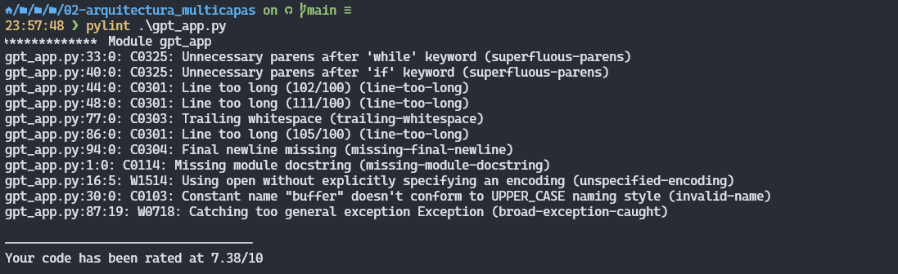
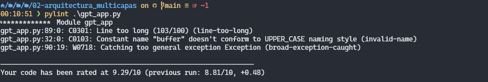

# Trabajo práctico
### Arquitectura multicapas

## Desarrollo

1. Se implemento el codigo necesario para hacer consultas a la API de ChatGPT y se pusheo el [commit](https://github.com/GabrielJHR/UADER_ISII_RAMOS/commit/6e81e76598a8a467f61992ef562c9da4ebca0237) en GitHub.
2. Se agregó la estructura Try/Except para controlar los posibles errores y se subio a GitHub en el siguiente [commit](https://github.com/GabrielJHR/UADER_ISII_RAMOS/commit/a928a8d8025d249c959f785bfc0fba542283c4fa).
3. Se agrego la capacidad de navegar en el historial de para recuperar los prompts anteriores con el modulo pyreadline3 que es una alternativa al modulo readline disponible para sistemas UNIX. En el siguiente [commit](https://github.com/GabrielJHR/UADER_ISII_RAMOS/commit/a928a8d8025d249c959f785bfc0fba542283c4fa) se guardaron los cambios en el codigo para implementar esta funcionalidad.
4. Se modifico el codigo para agregar la funcionalidad de que si en el prompt se escribe el parametro --convers se guarda en el buffer tanto las preguntas como las respuestas de ChatGPT. De esta forma a la api se le envia el buffer completo usando tanto las preguntas como las respuestas. En GitHub esta el [commit](https://github.com/GabrielJHR/UADER_ISII_RAMOS/commit/89763598141cc0b0f4ff920b601aea0665ddf7d9) con las modificaciones.
5. Se ejecuto la aplicacion multimetric sobre el codigo para analizarlo.
```json
{
  "files": {
    "C:\\Users\\gabri\\Documents\\UADER_ISII_RAMOS\\trabajos_practicos\\02-arquitectura_multicapas\\gpt_app.py": {
      "comment_ratio": 40.2970297029703,
      "cyclomatic_complexity": 8,
      "fanout_external": 2,
      "fanout_internal": 0,
      "halstead_bugprop": 0.5573056634057861,
      "halstead_difficulty": 15.200000000000001,
      "halstead_effort": 25413.138251303848,
      "halstead_timerequired": 1411.841013961325,
      "halstead_volume": 1671.9169902173583,
      "lang": [
        "Python"
      ],
      "loc": 1,
      "operands_sum": 152,
      "operands_uniq": 65,
      "operators_sum": 114,
      "operators_uniq": 13
    }
  },
  "overall": {
    "comment_ratio": 40.2970297029703,
    "cyclomatic_complexity": 8,
    "fanout_external": 2,
    "fanout_internal": 0,
    "halstead_bugprop": 0.5573056634057861,
    "halstead_difficulty": 15.200000000000001,
    "halstead_effort": 25413.138251303848,
    "halstead_timerequired": 1411.841013961325,
    "halstead_volume": 1671.9169902173583,
    "loc": 1,
    "maintainability_index": 100,
    "operands_sum": 152,
    "operands_uniq": 65,
    "operators_sum": 114,
    "operators_uniq": 13,
    "pylint": 100.0,
    "tiobe": 86.9009900990099,
    "tiobe_compiler": 100.0,
    "tiobe_complexity": 12.673267326732674,
    "tiobe_coverage": 100.0,
    "tiobe_duplication": 100.0,
    "tiobe_fanout": 100.0,
    "tiobe_functional": 100.0,
    "tiobe_security": 100.0,
    "tiobe_standard": 100.0
  },
  "stats": {
    "max": {
      "comment_ratio": 40.2970297029703,
      "cyclomatic_complexity": 8,
      "fanout_external": 2,
      "fanout_internal": 0,
      "halstead_bugprop": 0.5573056634057861,
      "halstead_difficulty": 15.200000000000001,
      "halstead_effort": 25413.138251303848,
      "halstead_timerequired": 1411.841013961325,
      "halstead_volume": 1671.9169902173583,
      "loc": 1,
      "operands_sum": 152,
      "operands_uniq": 65,
      "operators_sum": 114,
      "operators_uniq": 13
    },
    "mean": {
      "comment_ratio": 40.2970297029703,
      "cyclomatic_complexity": 8,
      "fanout_external": 2,
      "fanout_internal": 0,
      "halstead_bugprop": 0.5573056634057861,
      "halstead_difficulty": 15.200000000000001,
      "halstead_effort": 25413.138251303848,
      "halstead_timerequired": 1411.841013961325,
      "halstead_volume": 1671.9169902173583,
      "loc": 1,
      "operands_sum": 152,
      "operands_uniq": 65,
      "operators_sum": 114,
      "operators_uniq": 13
    },
    "median": {
      "comment_ratio": 40.2970297029703,
      "cyclomatic_complexity": 8,
      "fanout_external": 2,
      "fanout_internal": 0,
      "halstead_bugprop": 0.5573056634057861,
      "halstead_difficulty": 15.200000000000001,
      "halstead_effort": 25413.138251303848,
      "halstead_timerequired": 1411.841013961325,
      "halstead_volume": 1671.9169902173583,
      "loc": 1,
      "operands_sum": 152,
      "operands_uniq": 65,
      "operators_sum": 114,
      "operators_uniq": 13
    },
    "min": {
      "comment_ratio": 40.2970297029703,
      "cyclomatic_complexity": 8,
      "fanout_external": 2,
      "fanout_internal": 0,
      "halstead_bugprop": 0.5573056634057861,
      "halstead_difficulty": 15.200000000000001,
      "halstead_effort": 25413.138251303848,
      "halstead_timerequired": 1411.841013961325,
      "halstead_volume": 1671.9169902173583,
      "loc": 1,
      "operands_sum": 152,
      "operands_uniq": 65,
      "operators_sum": 114,
      "operators_uniq": 13
    }
  }
}
```
6. Se instalo pylint y se ejecuto por primera vez arrojando estos resultados:


    Luego se solucionaron algunas de las observaciones:
    

    Quedaron algunas observaciones dejadas intencionalmente.

    * Linea 89: La observacion de pylint recomienda usar menos caracteres para una linea a lo cual no me parecio correcto ya que necesitaba mostrar el mensaje completo por lo tanto no me parece correcto reducir los caracteres en esa linea.
    * Linea 32: En esta linea se observa que se define la variable buffer la cual se inicializa con un string vacio, pero pylint lo reconoce como una constante.
    * Linea 99: Por ultimo omiti esta observacion debido a que necesitaba una excepcion que detectara problemas generales que no se contemplen en el resto de excepciones.

    Se subio a GitHub el [commit](https://github.com/GabrielJHR/UADER_ISII_RAMOS/commit/e6bd9e9e25e60a07fdea80bba9e24e412cc37d35) correspondiente a estas correcciones.